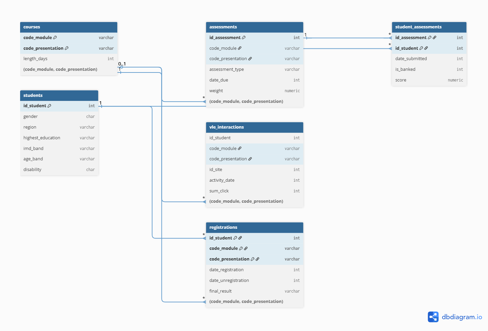

# EdTech Learner Analytics — SQL Deep Dive

An end-to-end SQL analytics project on the Open University Learning Analytics
Dataset: 32,593 students, 22 course presentations, and 10.6M virtual learning
environment (VLE) interaction records, loaded into a normalized PostgreSQL
schema and analysed through five business questions — from engagement and
funnel analysis to an at-risk learner scoring model. Headline result: a simple
3-signal risk score computed at day 150 identified a group of 139 learners of
whom 100% went on to fail or withdraw.

**Tech:** PostgreSQL 18 · Window Functions · CTEs · Multi-stage data loading

**Data:** [Open University Learning Analytics Dataset (OULAD)](https://archive.ics.uci.edu/dataset/349/open+university+learning+analytics+dataset) —
Kuzilek, J., Hlosta, M., & Zdrahal, Z. (2015). Licensed CC BY 4.0.

## Key Findings

- Less than half of enrolments succeed: 47.2% end in Pass/Distinction, and
  the single largest failure mode is withdrawal (31.2% of all enrolments).
- Drop-off accelerates through the learner journey (-8.8% → -15.7% → -20.1%
  → -30.5% stage-on-stage); the biggest single leak is learners who were
  active past the course midpoint yet never completed.
- Module BBB shows structurally weak early engagement (76–84% across all
  four presentations) — consistent enough to suggest onboarding design
  issues rather than one bad semester.
- Registration timing does NOT predict retention: late registrants (n=236)
  retained slightly better at month 6 (57.2%) than early ones (54.0%),
  disproving the initial hypothesis.
- A 3-signal risk score (recency, frequency vs own baseline, performance)
  validated with a perfectly monotonic gradient: bad-outcome rates of 100% /
  90% / 71% / 23% across CRITICAL / HIGH / WATCH / HEALTHY bands.

## Business Questions, Queries & Results

| # | Question | Query | Output & findings |
|---|----------|-------|-------------------|
| 1 | Which courses hook learners early — and which lose them? | [q1_early_engagement.sql](queries/q1_early_engagement.sql) | [results](results/q1_early_engagement.txt) |
| 2 | Where does the enrolment → completion funnel leak? | [q2_completion_funnel.sql](queries/q2_completion_funnel.sql) | [results](results/q2_completion_funnel.txt) |
| 3 | Does registration timing predict retention? | [q3_cohort_retention.sql](queries/q3_cohort_retention.sql) | [results](results/q3_cohort_retention.txt) |
| 4 | Which active learners are at risk right now? | [q4_at_risk_learners.sql](queries/q4_at_risk_learners.sql) | [results](results/q4_at_risk_learners.txt) |
| 5 | Does the risk score actually predict outcomes? | [q5_risk_validation.sql](queries/q5_risk_validation.sql) | [results](results/q5_risk_validation.txt) |

Every results file includes the query output plus written findings and caveats.

## The Completion Funnel

Five-stage funnel for course DDD (2013J), built with chained CTEs and
window functions (`FIRST_VALUE`, `LAG`):

````
              stage              | learners | pct_of_registered | drop_from_prev_pct
---------------------------------+----------+-------------------+--------------------
 Registered                      |     1938 |             100.0 |
 Engaged (clicked at least once) |     1768 |              91.2 |               -8.8
 Submitted first assessment      |     1491 |              76.9 |              -15.7
 Active past midpoint            |     1192 |              61.5 |              -20.1
 Completed (Pass/Distinction)    |      829 |              42.8 |              -30.5
````

No stage looks catastrophic in isolation, yet compounding leaks mean only
42.8% complete: 0.91 × 0.84 × 0.80 × 0.70 ≈ 0.43.

## Highlight: At-Risk Learner Scoring

Descriptive analytics tells you what happened; the goal here was a list a
program manager could act on Monday morning. Each active learner at day 150
is scored 0–9 on three signals: recency (days since last activity), frequency
vs their own baseline (is a regular learner fading?), and assessment
performance. Because the dataset records final outcomes, the score was
validated against reality:

| risk_band | learners | pct_bad_outcome | pct_withdrawn | pct_passed |
|-----------|---------:|----------------:|--------------:|-----------:|
| 1. CRITICAL (7-9) | 139 | 100.0 | 13.7 | 0.0 |
| 2. HIGH (5-6) | 133 | 90.2 | 19.5 | 9.8 |
| 3. WATCH (3-4) | 93 | 71.0 | 34.4 | 29.0 |
| 4. HEALTHY (0-2) | 1030 | 23.4 | 6.2 | 76.6 |

The bands also fail differently: CRITICAL learners mostly fail without
formally withdrawing, while WATCH learners withdraw at the highest rate —
suggesting different interventions per band. Scoring uses only data available
before the cutoff day (no leakage from future activity or outcomes).

## Database Schema



Six normalized tables: `courses`, `students`, `registrations`, `assessments`,
`student_assessments`, `vle_interactions`. Design notes:

- Staging-table loading: CSVs land in all-TEXT staging tables, then are
  typed and cleaned in SQL (`NULLIF` for the dataset's `?` missing-value
  markers, `DISTINCT ON` for deduplicating studentInfo's mixed grain).
- Idempotent loader: `TRUNCATE ... CASCADE` at the top makes the load
  script safe to re-run end to end.
- Deliberate tradeoff: no foreign key on the 10.6M-row interactions table —
  per-row FK checks slow bulk loads badly; integrity is enforced upstream.

## Setup

Download the OULAD CSVs (link above) into `data/`, then:

````
createdb oulad
psql -U postgres -d oulad -f schema/01_create_tables.sql
psql -U postgres -d oulad -f schema/02_load_data.sql
psql -U postgres -d oulad -f queries/q1_early_engagement.sql
````

## Limitations & Next Steps

- Risk score validated on one presentation (DDD 2013J); next step is applying
  the frozen scorer to a held-out presentation (DDD 2014J) to test
  generalization.
- Scoring thresholds are v1 domain judgments, not fitted parameters; a
  logistic regression on the same three signals is the natural upgrade.
- Q4/Q5 share a 5-CTE pipeline that should be refactored into a VIEW.
- Click counts are not comparable across modules with different VLE designs
  (see module GGG in Q1) — intensity metrics need per-module normalization.
````
````

**One fix before you preview:** the very last line of the block above ends with a stray ``` ``` `` — if after pasting you see an extra ``` ``` `` at the very bottom of the file after "normalization.", delete that last line. (Artifact of nesting code blocks.)

Then **Ctrl+Shift+V** to preview and check: ERD image displays, the two tables render as tables, the links in the questions table are clickable, no `<placeholder>` text anywhere.

The repo is now complete: schema, loader, 5 queries, 5 results files with findings, ERD, README. Last step is version control — git init, commit, and push to GitHub. Ready?